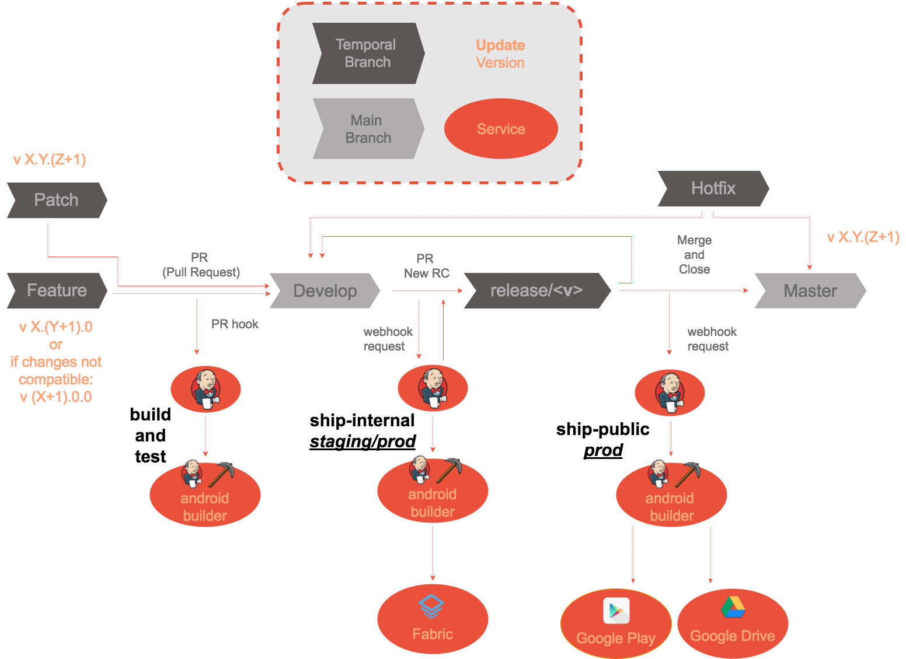

# Development Flow 1.0

Apps should follow `git-flow` based on:

- Versions get updated on Pull Requests.
- Have 3 jobs in jenkins:

  + **<app>-build-and-test**: release prod apk to fabric, listen to `master` branch.
    * debug version: `X.Y.Z-debug`
  + **<app>-ship-internal**: ship to `Fabric` `Production` and `staging` version.
    * staging version: `X.Y.Z-staging`
    * prod version: `X.Y.Z`
  + **<app>-ship-public**: ship to `Google Play` `Production` version.

